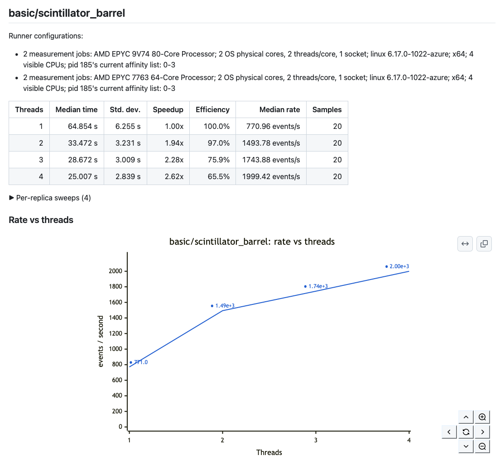

# ThreadScale

[][test-workflow]
[][marketplace]
[](LICENSE)

ThreadScale is a language-independent GitHub Action for measuring application strong scaling. It runs the same
command at several thread counts and reports runtime, throughput, speedup, and parallel efficiency. It also
ships a reusable workflow that discovers the runner's CPUs, fans measurements out to dynamic matrix jobs,
transfers partial results through artifacts, and produces the final report.

ThreadScale can be used in two ways:

- as `gemc/ThreadScale@v1` in GitHub Actions;
- as the included `./test_scaling` command on a local workstation or compute node.

It works with command-line thread arguments and environment variables such as `OMP_NUM_THREADS`,
`MKL_NUM_THREADS`, `OPENBLAS_NUM_THREADS`, `JULIA_NUM_THREADS`, and `RAYON_NUM_THREADS`.

<p align="center">
  
  <br>
  <em>A ThreadScale Job Summary from a replicated sweep: the runners that measured the benchmark, a table of median
time, speedup, and parallel efficiency at each thread count, and a rate-vs-threads chart with labeled points — all
rendered inline in GitHub Actions, with no externally hosted images.</em>
</p>

## Quick start: one-job sweep

```yaml
- name: Measure thread scaling
  uses: gemc/ThreadScale@v1
  with:
    command: ./myprogram --threads {threads}
    threads: auto
    runs: 5
    warmup-runs: 1
```

`threads: auto` measures every visible count from `1` through `N`. To reduce the number of points, use
`threads: powers-of-two`; the largest visible count is always included. Explicit lists and ranges preserve the
order in which their thread counts are written:

```yaml
threads: 1,2,4,8
# or
threads: 1-8
```

For OpenMP or another environment-variable interface:

```yaml
- uses: gemc/ThreadScale@v1
  with:
    command: ./myprogram
    thread-env: OMP_NUM_THREADS
    threads: powers-of-two
```

The command template also accepts `{run}`, `{replica}`, and `{benchmark}` placeholders. These are useful for
giving every invocation a distinct output filename.

## Local command-line runs

> **Upcoming in v1.0.2:** The local `test_scaling` command is not included in the published v1.0.1 release.

Clone ThreadScale on any machine with Node.js 24 or newer, then pass an arbitrary command containing the
`{threads}` placeholder:

```shell
git clone https://github.com/gemc/ThreadScale.git
cd ThreadScale

./test_scaling 'gemc example.yaml -n=50000 -nthreads={threads} -gstreamer=[]' \
  --name scintillator-barrel \
  --threads powers-of-two \
  --max-threads 64 \
  --duration 60 \
  --runs 3 \
  --warmup-runs 1 \
  --workload 50000 \
  --workload-unit events \
  --output-dir thread-scaling
```

The command is a template, and it must connect ThreadScale's selected count to the program's own threading
interface. ThreadScale replaces `{threads}` before every invocation. For the GEMC example above, the measured
commands include:

```text
threads=1  -> gemc example.yaml -n=50000 -nthreads=1  -gstreamer=[]
threads=2  -> gemc example.yaml -n=50000 -nthreads=2  -gstreamer=[]
threads=4  -> gemc example.yaml -n=50000 -nthreads=4  -gstreamer=[]
...
threads=64 -> gemc example.yaml -n=50000 -nthreads=64 -gstreamer=[]
```

For another application, put `{threads}` in whatever argument that application uses, such as
`./solver --workers={threads}` or `python simulation.py --processes {threads}`. ThreadScale cannot infer that
program-specific argument: a direct command must contain `{threads}` unless `--thread-env` is supplied.

This tests `1,2,4,8,16,32,64` when 64 CPUs are visible. Use `--threads auto` to test every integer from one
through the detected or configured maximum. `--duration` is the minimum cumulative measured time for each
thread count, while `--runs` is the minimum sample count; measurement continues until both requirements are
satisfied.

The local strategies use the same matrix and aggregation logic as the Action:

- `single-sweep` runs one complete sweep;
- `thread-sharded` stores each thread count as a separate partial result;
- `replicated-sweep --replicas N` runs `N` complete sweeps with rotated thread-count ordering.

`--fan-out` is accepted as an alias for `--strategy`.

Local measurements always execute sequentially so competing benchmark commands do not distort each other. For
programs controlled by an environment variable, omit `{threads}` and use, for example,
`--thread-env OMP_NUM_THREADS`. Options may precede a command after `--` when shell quoting is inconvenient.

For each selected value `N`, the environment-variable form runs the equivalent of
`OMP_NUM_THREADS=N ./myprogram`. In both forms, `N` is the number of threads requested from the application.
The operating system schedules those threads on the CPUs available to the process; ThreadScale does not pin
threads to particular physical cores. CPU discovery prevents automatic thread lists from exceeding the visible
logical CPUs, while `--max-threads` can cap the sweep below the detected count. The report records
physical-core, SMT, affinity, and cgroup information so the distinction remains visible when interpreting the
results.

The command prints `summary.md` to the terminal and creates the same CSV, JSON, Markdown, Mermaid summary, and
SVG artifacts as report mode. Raw partial JSON files are retained in a sibling directory ending in `.parts`.
The output and partial directories must not already exist.

## Distributed modes

GitHub does not allow a step-level Action to add workflow jobs after a job starts. ThreadScale therefore
includes a reusable workflow for discovery, dynamic fan-out, artifact transfer, and final aggregation.

| Strategy | Matrix entry | Best use |
|---|---|---|
| `single-sweep` | One complete sweep per benchmark | Fast pull-request signal |
| `thread-sharded` | One benchmark and one thread count | Lower runtime per job; cross-VM comparisons |
| `replicated-sweep` | Complete sweep per replica | Hosted-runner statistics and paired comparisons |

`replicated-sweep` is the recommended statistical mode. Each replica measures every count on one VM, avoiding a
comparison in which every point necessarily comes from a different hosted runner. With `replicas: auto`, the
workflow creates one replica per tested thread count. Reported speedup is the median of the within-replica
speedups; sharded measurements fall back to the ratio of aggregated median times. Replicated jobs rotate the
thread-count order by replica, preventing every high-thread measurement from systematically running last.

```yaml
name: Scaling

on:
  workflow_dispatch:

jobs:
  scaling:
    uses: gemc/ThreadScale/.github/workflows/thread-scaling.yml@v1
    with:
      strategy: replicated-sweep
      threads: auto
      runs: 5
      warmup-runs: 1
      setup-command: cmake -S . -B build && cmake --build build --parallel
      benchmarks: >-
        [
          {
            "name": "solver",
            "command": "./build/solver --threads {threads} --input medium.dat",
            "working_directory": ".",
            "workload": 1000000,
            "workload_unit": "cells"
          }
        ]
```

The reusable workflow checks out the caller repository in every measurement job. `setup-command` is optional and
runs once in each such job. Projects with expensive builds can instead download a prebuilt artifact in that
command or copy the three-job discovery/benchmark/report pattern from the reusable workflow into their own CI.

## Results

Benchmark mode writes one portable partial JSON file. Report mode recursively merges partials and creates:

```text
thread-scaling/
├── scaling.csv
├── scaling.json
├── summary.md
└── benchmark-name/
    ├── efficiency-vs-threads.svg
    ├── rate-vs-threads.svg
    ├── speedup-vs-threads.svg
    ├── time-vs-threads.svg
    └── replicas/replica-N/
        ├── rate-vs-threads.svg
        ├── speedup-vs-threads.svg
        └── time-vs-threads.svg
```

The report artifact contains these dependency-free SVG plots for each benchmark:

| Plot | Measured value | Reference line |
|---|---|---|
| `time-vs-threads.svg` | Median wall-clock time at each thread count | Ideal runtime, `T(1) / N` |
| `rate-vs-threads.svg` | `workload / median time` | None |
| `speedup-vs-threads.svg` | `T(1) / T(N)`, or paired speedup for replicated sweeps | Ideal speedup, `N` |
| `efficiency-vs-threads.svg` | `speedup / N × 100%` | Ideal efficiency, `100%` |

The rate plot is generated only when `workload` is greater than zero. All SVG plots remain sharp when downloaded
or included in project documentation. They mark every measured point with an outlined dot and print its y-value
next to the marker.

The GitHub Job Summary renders a Mermaid time-vs-threads chart and rate-vs-threads chart after each benchmark
table. Mermaid's `xychart` lines do not support point labels, so each summary chart is followed by a
measured-point key containing a dot, thread count, and y-value. The table above the charts contains the complete
statistics for each point.

> **Upcoming in v1.0.2:** Numeric-only Mermaid series fix summary-chart parsing in GitHub.

Use `summary-plots` to select `none`, `time`, `rate`, or `both` (the default). Rate charts require a positive
`workload`; `workload-unit` supplies the rate label. This setting controls only charts embedded in the Job
Summary, not the SVG files stored in the report artifact.

The job summary contains a table like this (the effective serial fraction is upcoming in v1.0.2):

```text
Threads   Median time   Speedup   Efficiency   Effective serial   Median rate   Samples
      1       18.420 s     1.00x       100.0%                  —      54.29/s        20
      2        9.730 s     1.89x        94.7%               5.8%     102.77/s        20
      4        5.210 s     3.54x        88.4%               4.3%     191.94/s        20
      8        3.280 s     5.62x        70.2%               6.1%     304.88/s        20
```

Speedup, efficiency, and effective serial fraction use the median one-thread runtime:

```text
S(N) = T(1) / T(N)
E(N) = S(N) / N × 100%
F(N) = (1 / S(N) - 1 / N) / (1 - 1 / N) × 100%
```

Lower effective serial fractions are better. The value approximates how much of the application's execution
behaves serially, but it also includes parallel overhead, contention, and measurement effects; it is not a
literal percentage of source code. The fraction is undefined at one thread, and superlinear scaling can produce
a negative estimate.

The aggregate table includes runtime standard deviation. An expandable per-replica table and the SVG files
under `replicas/` preserve each runner's curve so heterogeneous hosted machines are not hidden by pooled
medians.

Set `minimum-efficiency` to a fraction such as `0.60` to fail report mode when efficiency at the largest tested
thread count falls below the threshold.

## CPU and runner discovery

ThreadScale uses Node's affinity-aware available-parallelism value, `nproc` when present, and Linux cgroup CPU
quotas. It takes the most restrictive detected value and applies `max-threads` last. Reports retain:

- visible and logical CPU counts;
- OS-reported physical cores, sockets, cores per socket, threads per core, and NUMA nodes;
- CPU model, architecture, operating system, and runner labels;
- Linux process affinity from `taskset`, when available;
- `lscpu` output, when available;
- the effective cgroup CPU quota, when present.

This metadata is important when comparing results across runner generations or self-hosted machines.

## Action modes

The root Action has three modes so custom workflows can use the same implementation as the reusable workflow:

- `discover` detects CPUs and emits `cores`, `thread-list`, `runner-metadata`, `job-count`, and a dynamic
  `matrix` for one of the three strategies.
- `benchmark` performs warmups and measured runs, then emits `result-file` and `results-dir`.
- `report` merges downloaded partials, emits final file paths, adds the Markdown report to the job summary, and
  applies the optional efficiency threshold.

Discover mode accepts a JSON `benchmarks` array. Every object requires `name` and `command`; optional fields are
`working_directory`, `workload`, and `workload_unit`.

## Benchmarking guidance

Ordinary GitHub-hosted runners are useful for checking whether threading works, catching catastrophic scaling
regressions, and locating obvious saturation. They are shared virtual machines and are not controlled HPC
benchmark nodes. Prefer replicated sweeps, medians, and a generous regression threshold. Use a stable,
self-hosted runner with pinned CPU frequency and no competing load for publication-quality measurements.

Keep the workload large enough that process startup and setup are a small fraction of runtime. Run identical
work at every thread count, avoid unrelated I/O where possible, and use warmup runs for applications with caches
or just-in-time compilation.

## Development and releases

ThreadScale has no runtime dependencies and does not need a bundled `node_modules` tree. Local checks require
Node.js 24:

```shell
npm run check
npm test
```

To publish in the GitHub Actions Marketplace, create a release whose tag also has a stable major alias such as
`v1`. Consumers should use the major tag or pin a full commit SHA when reproducibility or supply-chain policy
requires it. Publish the `v1` tag before consumers invoke the reusable workflow; its internal Action references
also use that stable major tag.

## Contributing

ThreadScale is free and open. Contributions are welcome, and we are happy to
develop it together — a pull request is the way to go. See [`CONTRIBUTING.md`](CONTRIBUTING.md) for setup, local
checks, and the pull-request checklist.

For questions or direct contact, open an issue or email **ungaro@jlab.org** 
([Maurizio Ungaro](https://github.com/maureeungaro/maureeungaro)).

ThreadScale is available under the [MIT License](LICENSE).

[test-workflow]: https://github.com/gemc/ThreadScale/actions/workflows/test.yml
[marketplace]: https://github.com/marketplace/actions/threadscale
